# Scalable Customer Churn Prediction Using Apache Spark and Machine Learning

## Overview

This project investigates customer churn prediction using **Apache Spark** and **machine learning**, with emphasis on both predictive performance and computational scalability.

The main objective is to compare multiple machine-learning algorithms in terms of:

- Predictive performance
- Computational scalability
- Training cost
- Prediction cost
- Practical suitability as workload size increases

Four classification algorithms are implemented using **Apache Spark MLlib**:

- Logistic Regression
- Decision Tree
- Random Forest
- Gradient Boosted Tree

The original Telco Customer Churn dataset contains **7,043 customer records**. After data cleaning, **7,032 observations** are used for modelling.

The original dataset is relatively small and is **not claimed to be a Big Data dataset**. Apache Spark is used as the data-processing and machine-learning framework to build the pipeline and to investigate computational behaviour under controlled increases in workload size.

In addition to evaluating predictive performance on a held-out test set, the project investigates how model training and prediction times change as computational workload size increases.

Synthetic workloads ranging from **1x to 100x** are created by replicating the original training and testing observations separately.

The largest computational workload contains:

```text
703,200 rows
```

> **Important:** The scaled workloads are created through replication for computational scalability testing. They do not represent 703,200 independent customers and are not used as evidence of improved predictive generalization.

---

## Research Questions

This project investigates the following research questions:

**RQ1:** How accurately can machine-learning algorithms predict customer churn?

**RQ2:** How do Logistic Regression, Decision Tree, Random Forest, and Gradient Boosted Tree compare in predictive performance?

**RQ3:** How does increasing workload size affect training and prediction time using Apache Spark?

**RQ4:** Which model provides the best balance between predictive performance and computational scalability?

---

## Research Contribution

The project provides a controlled comparison of the predictive performance and computational scalability of four Spark MLlib classifiers for customer churn.

The experiment combines:

- A common preprocessing pipeline
- A consistent train/test split
- Four Spark MLlib classifiers
- Held-out predictive evaluation
- Synthetic workloads from 1x to 100x
- Three repeated timing trials per model/workload combination
- 72 total timing trials
- Mean execution times
- Timing standard deviations
- Training throughput
- Prediction throughput
- Reproducible result visualizations

The purpose is not to claim that the replicated dataset becomes a genuinely larger independent customer dataset. Replication is used specifically to increase computational workload while preserving the original experimental data.

The project should therefore be interpreted as a **controlled Spark-based scalability study in a local computing environment**, rather than as a demonstration of a production-scale distributed Big Data deployment.

---

## Technologies

The project uses:

- Python
- PySpark
- Apache Spark
- Spark MLlib
- Spark SQL
- Parquet
- Matplotlib
- NumPy

Apache Spark is a technology designed for scalable and distributed data processing. In this project, however, Spark is executed locally using:

```text
local[2]
```

This configuration provides two local Spark execution threads.

Therefore, the scalability results represent **local parallel Spark workload behaviour on a single machine**, rather than multi-node distributed-cluster scalability.

---

## Dataset

The project uses the **Telco Customer Churn** dataset.

After preprocessing:

| Property | Value |
|---|---:|
| Original observations | 7,043 |
| Clean observations | 7,032 |
| Removed observations | 11 |
| Number of features | 45 |
| Non-churn observations | 5,163 |
| Churn observations | 1,869 |

The target variable is binary:

- `0` = No Churn
- `1` = Churn

The dataset contains customer information related to services, contracts, billing, tenure, payment methods, and other customer characteristics.

The dataset is suitable for demonstrating the complete Spark machine-learning workflow and for establishing the baseline predictive experiment. However, its **7,032 cleaned independent observations are not characterized as Big Data**.

### Raw Dataset Availability

The raw dataset is **not committed to this repository**.

Place the dataset locally at:

```text
data/Telco-Customer-Churn.csv
```

This keeps third-party raw data separate from the source code and generated experimental results.

---

## Data Preprocessing

Data preprocessing is performed using Apache Spark.

The preprocessing pipeline includes:

1. Loading the raw CSV dataset
2. Cleaning blank and invalid values
3. Converting numerical attributes to appropriate data types
4. Removing incomplete observations
5. Encoding categorical variables using `StringIndexer`
6. Applying one-hot encoding using `OneHotEncoder`
7. Combining predictors using `VectorAssembler`
8. Converting the churn target into a numeric label
9. Saving the processed dataset in Parquet format

The final processed dataset contains a Spark ML feature vector with **45 features**.

Using Parquet allows the Spark feature-vector representation to be preserved and loaded directly during model training.

---

## Machine-Learning Models

Four Spark MLlib classification algorithms are evaluated.

### Logistic Regression

Configuration:

```text
maxIter = 50
```

### Decision Tree

Configuration:

```text
maxDepth = 5
seed = 42
```

### Random Forest

Configuration:

```text
numTrees = 50
maxDepth = 8
seed = 42
```

### Gradient Boosted Tree

Configuration:

```text
maxIter = 30
seed = 42
```

---

## Train/Test Design

The cleaned dataset is divided into training and testing partitions using an approximately 80/20 split with seed `42`.

| Split | Rows | Percentage |
|---|---:|---:|
| Training | 5,690 | 80.92% |
| Testing | 1,342 | 19.08% |
| Total | 7,032 | 100% |

Predictive conclusions are based on the **held-out test set**.

The training and testing partitions remain separate during the scalability experiment.

---

## Evaluation Metrics

### Predictive Performance

Predictive performance is evaluated using:

- Accuracy
- Churn-class Precision
- Churn-class Recall
- Churn-class F1 Score
- Weighted F1 Score
- ROC-AUC
- Confusion Matrix

### Computational Performance

Computational scalability is evaluated using:

- Training time
- Prediction time
- Training throughput
- Prediction throughput
- Mean execution time
- Sample standard deviation across repeated trials

---

# Baseline Predictive Results

The four models are evaluated on the same held-out test set.

| Model | Accuracy | Churn Precision | Churn Recall | Churn F1 | Weighted F1 | ROC-AUC |
|---|---:|---:|---:|---:|---:|---:|
| Logistic Regression | 0.8219 | 0.7016 | 0.5912 | 0.6417 | 0.8168 | 0.8549 |
| Decision Tree | 0.7951 | 0.6883 | 0.4392 | 0.5363 | 0.7789 | 0.7473 |
| Random Forest | 0.8115 | 0.7243 | 0.4862 | 0.5818 | 0.7983 | 0.8532 |
| Gradient Boosted Tree | 0.8025 | 0.6633 | 0.5442 | 0.5979 | 0.7960 | 0.8434 |

Logistic Regression achieved the strongest overall baseline predictive performance.

Its main results were:

- Accuracy: **82.19%**
- ROC-AUC: **85.49%**
- Churn-class F1: **64.17%**
- Churn recall: **59.12%**
- Churn precision: **70.16%**

Random Forest achieved the highest churn precision:

```text
72.43%
```

---

## Baseline Predictive Visualizations

### Overall Predictive Metrics

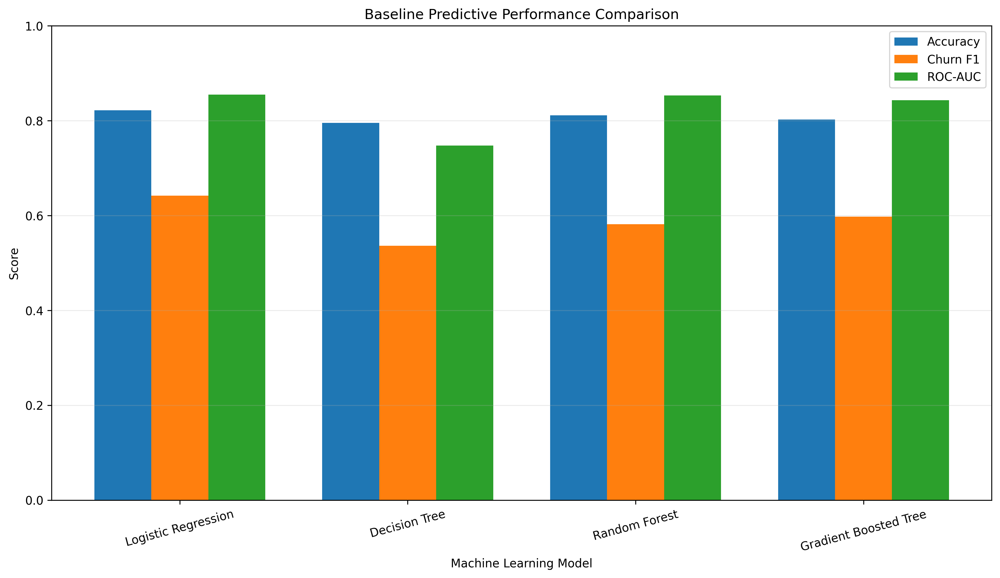

### Accuracy Comparison

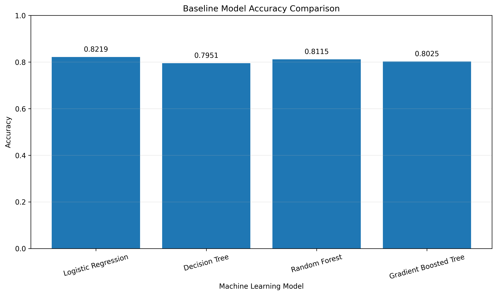

### ROC-AUC Comparison

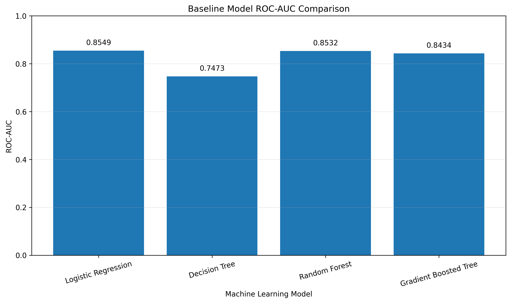

### Churn-Class F1 Comparison

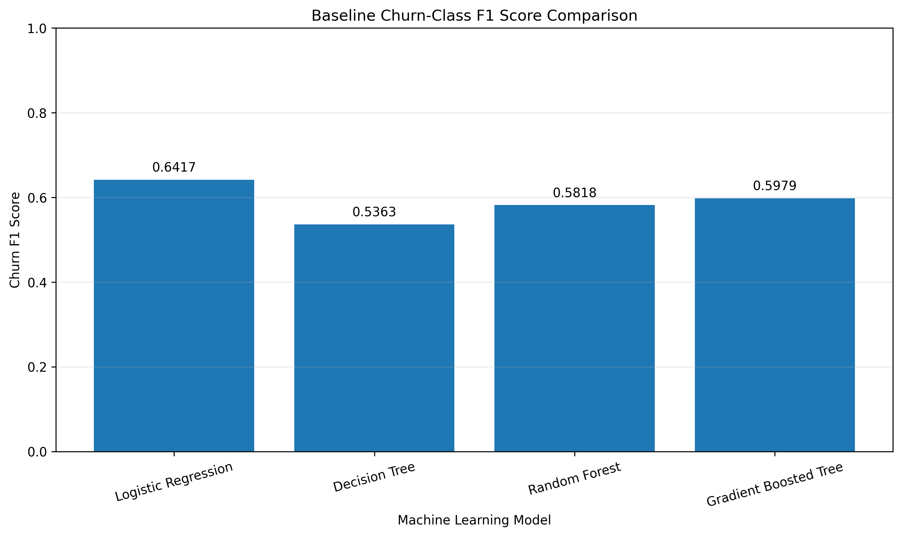

---

## Baseline Confusion Matrices

### Logistic Regression

| | Predicted No Churn | Predicted Churn |
|---|---:|---:|
| Actual No Churn | 889 | 91 |
| Actual Churn | 148 | 214 |

### Decision Tree

| | Predicted No Churn | Predicted Churn |
|---|---:|---:|
| Actual No Churn | 908 | 72 |
| Actual Churn | 203 | 159 |

### Random Forest

| | Predicted No Churn | Predicted Churn |
|---|---:|---:|
| Actual No Churn | 913 | 67 |
| Actual Churn | 186 | 176 |

### Gradient Boosted Tree

| | Predicted No Churn | Predicted Churn |
|---|---:|---:|
| Actual No Churn | 880 | 100 |
| Actual Churn | 165 | 197 |

---

# Scalability Experiment

Computational scalability is evaluated using six workload sizes.

| Scale | Total Rows | Training Rows | Testing Rows |
|---|---:|---:|---:|
| 1x | 7,032 | 5,690 | 1,342 |
| 5x | 35,160 | 28,450 | 6,710 |
| 10x | 70,320 | 56,900 | 13,420 |
| 20x | 140,640 | 113,800 | 26,840 |
| 50x | 351,600 | 284,500 | 67,100 |
| 100x | 703,200 | 569,000 | 134,200 |

The training and testing partitions are replicated separately so that the original train/test separation is preserved.

These scaled workloads are **computational workloads only**. Increasing the number of replicated rows increases the amount of data Spark must process, but it does not introduce new independent customer information.

The experiment includes Spark/JVM warm-up before measured trials.

Each model/workload combination is measured three times.

The complete benchmark therefore contains:

```text
6 workload sizes × 4 models × 3 trials = 72 timing trials
```

Mean execution time and sample standard deviation are calculated from the repeated measurements.

The scalability script also supports checkpointed experiment output so completed trials can be preserved during longer benchmark runs.

---

## Mean Training-Time Scalability

Mean training times from the repeated benchmark are:

| Scale | Logistic Regression | Decision Tree | Random Forest | Gradient Boosted Tree |
|---|---:|---:|---:|---:|
| 1x | 4.8468 | 1.2778 | 4.0490 | 10.5372 |
| 5x | 4.5068 | 1.3542 | 11.5498 | 20.4117 |
| 10x | 4.7918 | 2.7332 | 16.7450 | 17.8584 |
| 20x | 6.6230 | 3.1980 | 20.3389 | 20.3304 |
| 50x | 8.8667 | 7.0727 | 36.6863 | 50.4437 |
| 100x | 16.5364 | 16.1523 | 76.2010 | 92.9097 |

At larger workloads, Random Forest and Gradient Boosted Tree require substantially more training time than Logistic Regression.

### Training-Time Scalability

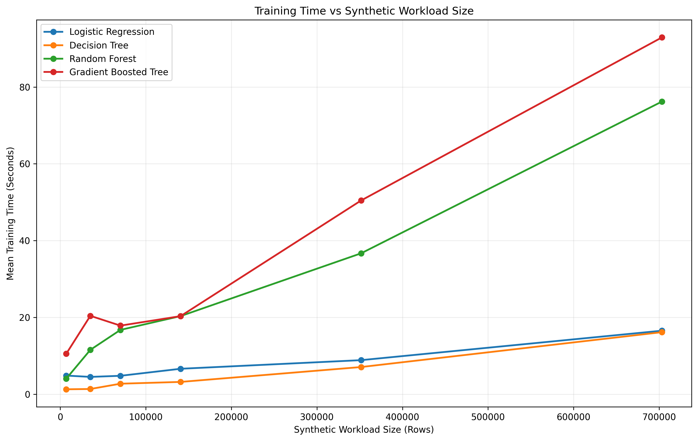

### Training Time with Error Bars

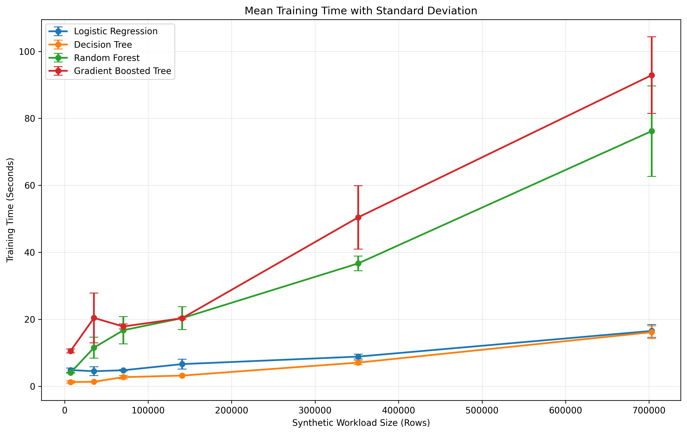

---

## Mean Prediction-Time Scalability

Mean prediction times from the repeated benchmark are:

| Scale | Logistic Regression | Decision Tree | Random Forest | Gradient Boosted Tree |
|---|---:|---:|---:|---:|
| 1x | 0.3281 | 0.3808 | 0.3815 | 0.2452 |
| 5x | 0.2104 | 0.1994 | 0.6434 | 0.4039 |
| 10x | 0.2095 | 0.2464 | 0.7488 | 0.3605 |
| 20x | 0.2358 | 0.2829 | 0.8623 | 0.3610 |
| 50x | 0.3076 | 0.3597 | 1.2891 | 0.7947 |
| 100x | 0.5039 | 0.6754 | 2.2469 | 1.4822 |

Prediction time generally increases as workload size becomes larger.

Small-scale measurements are not perfectly monotonic because JVM warm-up, Spark scheduling, caching, task-startup overhead, and normal operating-system variability have greater influence when individual jobs are small.

### Prediction-Time Scalability

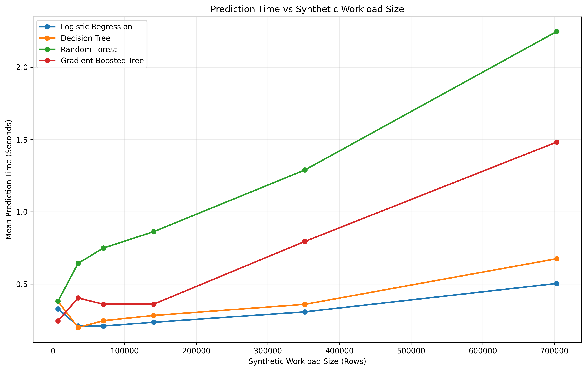

### Prediction Time with Error Bars

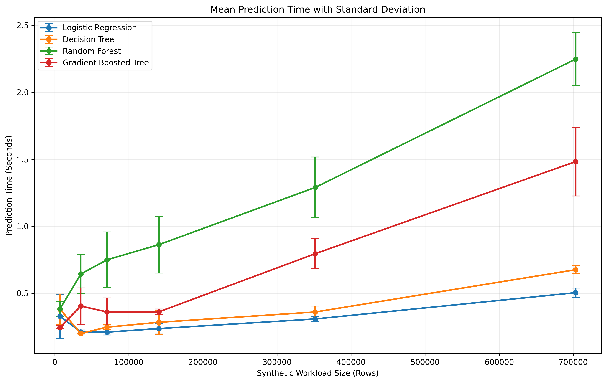

---

## Throughput Analysis

Execution time alone does not fully describe computational behaviour.

Training and prediction throughput are also calculated to show how many rows are processed per second at different workload sizes.

### Training Throughput

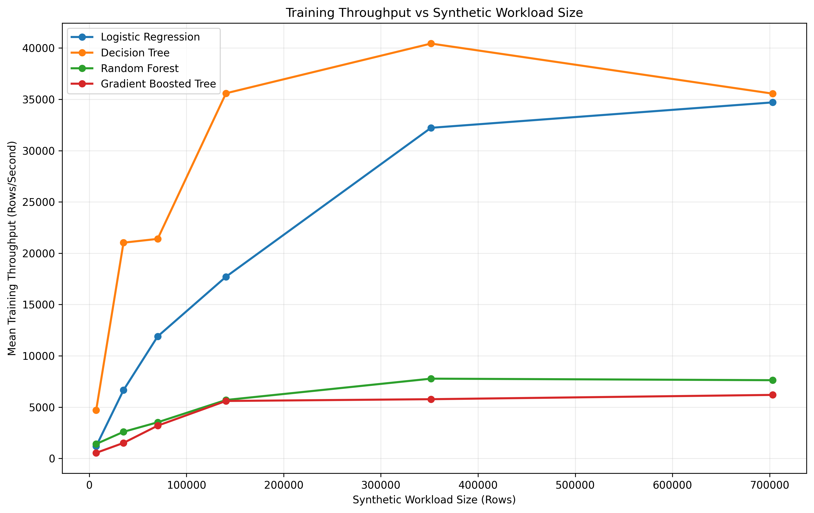

### Prediction Throughput

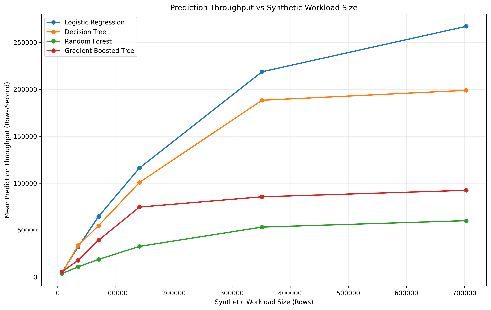

---

# Largest Workload Comparison

At the **100x workload**, corresponding to 703,200 total replicated rows:

| Model | Accuracy | ROC-AUC | Mean Training Time (s) | Training SD (s) | Mean Prediction Time (s) | Prediction SD (s) |
|---|---:|---:|---:|---:|---:|---:|
| Logistic Regression | 0.8219 | 0.8549 | 16.5364 | 1.8987 | 0.5039 | 0.0344 |
| Decision Tree | 0.7936 | 0.7455 | 16.1523 | 1.9169 | 0.6754 | 0.0289 |
| Random Forest | 0.8145 | 0.8529 | 76.2010 | 13.5178 | 2.2469 | 0.1982 |
| Gradient Boosted Tree | 0.8137 | 0.8450 | 92.9097 | 11.4308 | 1.4822 | 0.2572 |

At 100x:

- Logistic Regression training: **16.54 seconds**
- Decision Tree training: **16.15 seconds**
- Random Forest training: **76.20 seconds**
- Gradient Boosted Tree training: **92.91 seconds**

Compared with Logistic Regression:

- Random Forest required approximately **4.61x** as much mean training time.
- Gradient Boosted Tree required approximately **5.62x** as much mean training time.

The predictive metrics reported at replicated workloads are treated only as consistency checks.

They are **not interpreted as evidence that predictive performance improves with additional replicated rows**, because those rows are copies of existing observations rather than new independent customers.

### 100x Training-Time Comparison

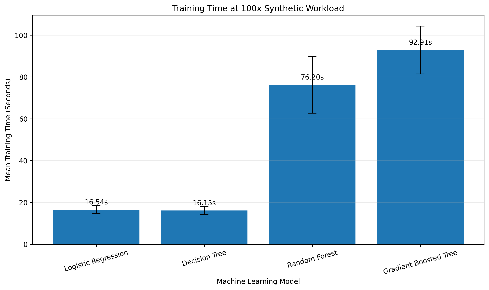

### 100x Prediction-Time Comparison

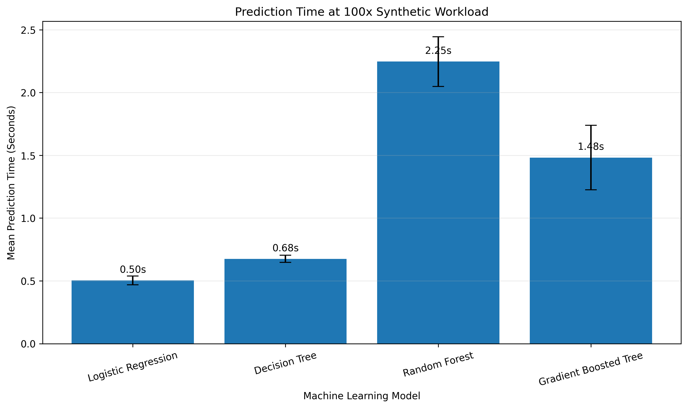

---

# Main Finding

The experiments indicate that **Logistic Regression provides the strongest overall balance between predictive performance and computational scalability** among the four models tested in this project.

Logistic Regression achieved the highest baseline:

- Accuracy
- Churn-class F1 score
- Weighted F1 score
- ROC-AUC

It also maintained substantially lower training cost than Random Forest and Gradient Boosted Tree at the largest synthetic workload.

Random Forest achieved a similar ROC-AUC but required considerably more training time as workload size increased.

Gradient Boosted Tree also provided competitive predictive performance but showed the highest mean training cost at the largest workload.

Decision Tree was computationally inexpensive at smaller workloads but produced weaker predictive results, particularly in ROC-AUC and churn recall.

These findings apply specifically to the experimental environment used in this project.

They should not be interpreted as evidence that Logistic Regression will always outperform other models on different datasets, hardware configurations, Spark clusters, or modelling tasks.

---

# Result Figures

The visualization pipeline generates **14 result figures**:

```text
results/figures/
│
├── baseline_predictive_metrics_comparison.png
├── model_accuracy_comparison.png
├── model_auc_comparison.png
├── churn_f1_comparison.png
├── baseline_training_time_comparison.png
├── baseline_prediction_time_comparison.png
├── training_time_scalability.png
├── training_time_with_error_bars.png
├── prediction_time_scalability.png
├── prediction_time_with_error_bars.png
├── training_throughput_scalability.png
├── prediction_throughput_scalability.png
├── 100x_training_time_comparison.png
└── 100x_prediction_time_comparison.png
```

The most important figures are displayed directly in this README, while all generated figures are available in the `results/figures/` directory.

---

# Project Structure

```text
Scalable_ML_Big_Data_Project/
│
├── README.md
├── requirements.txt
├── .gitignore
│
├── data/
│   ├── .gitkeep
│   ├── Telco-Customer-Churn.csv
│   └── processed/
│       └── churn_data.parquet/
│
├── models/
│   ├── Logistic_Regression/
│   ├── Decision_Tree/
│   ├── Random_Forest/
│   └── Gradient_Boosted_Tree/
│
├── predictions/
│
├── results/
│   ├── model_comparison.csv
│   ├── scalability_trials.csv
│   ├── scalability_repeated_results.csv
│   ├── churn_predictions/
│   └── figures/
│
└── src/
    ├── load_data.py
    ├── data_preprocessing.py
    ├── train_model.py
    ├── predict.py
    ├── scalability_experiment.py
    └── visualize_results.py
```

Generated datasets, trained models, prediction outputs, and other large or reproducible artifacts are excluded from version control where appropriate.

---

# Installation

## 1. Clone the Repository

```bash
git clone https://github.com/irshadahmedlakhan/scalable-customer-churn-prediction.git
```

Move into the project directory:

```bash
cd scalable-customer-churn-prediction
```

---

## 2. Install Python Dependencies

Install the required packages using:

```bash
pip install -r requirements.txt
```

The project requirements are:

```text
pyspark
matplotlib
numpy
```

Apache Spark also requires a compatible Java installation.

---

# How to Run the Project

Run the commands below from the project root directory.

## 1. Prepare the Dataset

Place the raw Telco Customer Churn CSV file at:

```text
data/Telco-Customer-Churn.csv
```

---

## 2. Inspect the Raw Dataset

Run:

```bash
python src/load_data.py
```

This loads the raw CSV file using Spark and provides basic dataset inspection.

---

## 3. Run Data Preprocessing

Run:

```bash
python src/data_preprocessing.py
```

This:

- Cleans the dataset
- Encodes categorical variables
- Creates the feature vector
- Creates the binary churn label
- Saves the processed Spark dataset as Parquet

The generated processed data is stored locally under:

```text
data/processed/
```

---

## 4. Train and Evaluate the Models

Run:

```bash
python src/train_model.py
```

This script:

- Loads the processed dataset
- Creates the train/test split
- Trains all four classifiers
- Evaluates them on the held-out test set
- Calculates predictive metrics
- Saves trained Spark models
- Saves the model-comparison results

Model evaluation is performed directly inside `train_model.py`.

---

## 5. Generate Churn Predictions

Run:

```bash
python src/predict.py
```

This demonstrates inference using a trained Spark model and produces churn predictions.

> The prediction output is an inference demonstration. It is not used as a replacement for held-out test-set evaluation.

---

## 6. Run the Scalability Experiment

Run:

```bash
python src/scalability_experiment.py
```

This performs repeated computational benchmarking across:

```text
1x
5x
10x
20x
50x
100x
```

For every workload size, each of the four models is measured three times.

The full benchmark contains:

```text
72 timing trials
```

The experiment records raw trials as well as aggregated mean and standard-deviation results.

Because the benchmark can take considerably longer than the baseline training run, intermediate/checkpoint results are used to reduce the risk of losing completed measurements if execution is interrupted.

---

## 7. Generate Visualizations

Run:

```bash
python src/visualize_results.py
```

The script generates 14 figures and stores them in:

```text
results/figures/
```

---

# Generated Outputs

Important experiment outputs include:

```text
results/model_comparison.csv
results/scalability_trials.csv
results/scalability_repeated_results.csv
results/figures/
```

Other generated artifacts include:

```text
data/processed/
models/
predictions/
results/churn_predictions/
```

Some generated artifacts are intentionally ignored by Git because they can be reproduced by running the project scripts.

---

# Reproducibility

Several measures are used to improve experiment reproducibility:

- A fixed random seed of `42` is used where applicable.
- All four classifiers use the same preprocessing pipeline.
- Models are evaluated using the same held-out test set.
- Training and testing partitions remain separate during workload replication.
- Scalability timing measurements are repeated three times.
- Mean and sample standard deviation are reported instead of relying on a single timing measurement.
- Raw timing trials are preserved in `scalability_trials.csv`.
- Aggregated timing results are preserved in `scalability_repeated_results.csv`.
- Result visualizations are generated programmatically.
- Project paths are resolved relative to the source files rather than relying on a fixed absolute project directory.

Computational timings may still vary between machines because of differences in:

- Processor performance
- Available memory
- Java/JVM state
- Spark version
- Operating-system activity
- Disk performance
- Background applications
- Spark scheduling behaviour

---

# Interpretation of Scalability Results

This project distinguishes between two different questions:

### Predictive Evaluation

Predictive evaluation asks:

> How well does a trained model generalize to held-out customer observations?

This is answered using the original held-out test partition.

### Computational Scalability

The scalability experiment asks:

> How does Spark computational cost change when the amount of data processed by the model increases?

This is investigated using replicated workloads.

These two objectives should not be confused.

Replication increases the amount of computation but **does not create new independent information**.

For this reason, changes in predictive metrics at replicated workload sizes are not interpreted as evidence that larger replicated datasets improve generalization.

---

# Limitations

This project has several limitations:

- The cleaned dataset contains only **7,032 independent customer observations**.
- The original dataset is relatively small and is **not considered a Big Data dataset**.
- Larger workloads are generated through replication and do not represent additional independent customers.
- Replicated workloads are used only for computational scalability testing.
- Spark is executed using `local[2]` on a single machine.
- The experiment therefore does not demonstrate multi-node cluster scalability.
- Only four machine-learning algorithms are evaluated.
- Fixed hyperparameter configurations are used.
- No dedicated class-balancing technique is evaluated.
- No extensive hyperparameter search is performed.
- Computational timings can be influenced by hardware, JVM state, caching, operating-system activity, and Spark scheduling.
- Tree-based model behaviour may vary slightly when workload replication changes Spark partitioning or approximate feature-binning behaviour.

These limitations mean that the project should be interpreted as a **controlled local Spark scalability experiment and machine-learning comparison**, rather than as evidence of production-scale distributed Big Data performance.

---

# Future Work

Possible future improvements include:

- Testing genuinely large datasets containing independent observations
- Running the experiment on a multi-node Spark cluster
- Using cloud-based Spark environments
- Performing systematic hyperparameter optimization
- Applying cross-validation
- Investigating class weighting and resampling
- Performing classification-threshold optimization to improve churn recall
- Adding feature-importance analysis
- Adding model-interpretability methods
- Measuring memory consumption
- Measuring end-to-end pipeline latency
- Comparing Spark MLlib with additional scalable machine-learning frameworks
- Evaluating the workflow using datasets containing millions of independent records

---

# Conclusion

This project demonstrates how Apache Spark MLlib can be used not only to build customer-churn prediction models but also to investigate their computational behaviour as workload size increases.

The project uses a relatively small original customer dataset and therefore does **not claim that the source dataset itself constitutes Big Data**. Instead, Apache Spark provides the computational framework for implementing the machine-learning workflow and conducting controlled scalability experiments using increasing replicated workloads.

Among the four evaluated classifiers, Logistic Regression provided the strongest overall balance of predictive performance and computational cost in the tested environment.

On the original held-out test set, Logistic Regression achieved:

```text
Accuracy: 0.8219
ROC-AUC: 0.8549
Churn F1: 0.6417
```

At the 100x workload, its mean training time was:

```text
16.5364 seconds
```

compared with:

```text
Random Forest:         76.2010 seconds
Gradient Boosted Tree: 92.9097 seconds
```

The results demonstrate why predictive quality and computational efficiency should be considered together when evaluating machine-learning systems intended for increasing data workloads.

The study provides a reproducible foundation that can be extended in future work using genuinely large independent datasets and multi-node or cloud-based Spark environments.

---

## Author

**Irshad Ahmed**  
Nanjing University

Research Project: **Scalable Customer Churn Prediction Using Apache Spark and Machine Learning**

Technologies:

**Python · PySpark · Apache Spark · Spark MLlib · Machine Learning · Scalability Analysis**